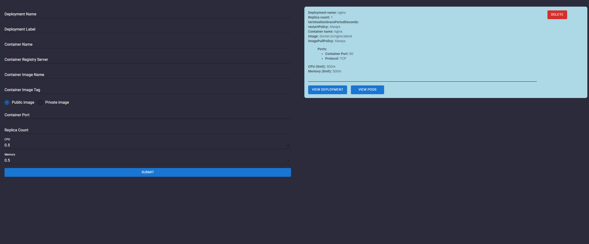
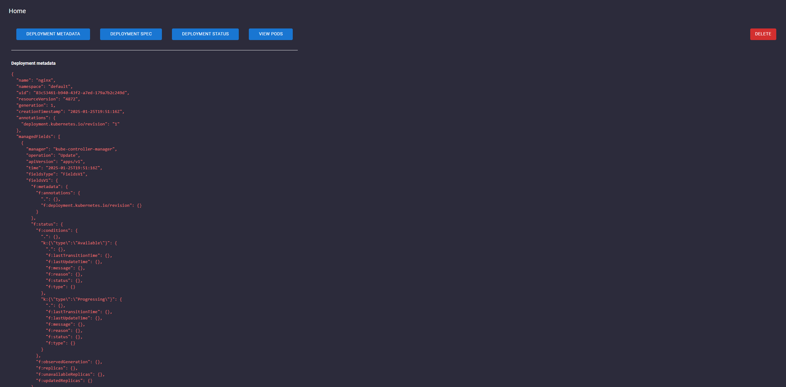
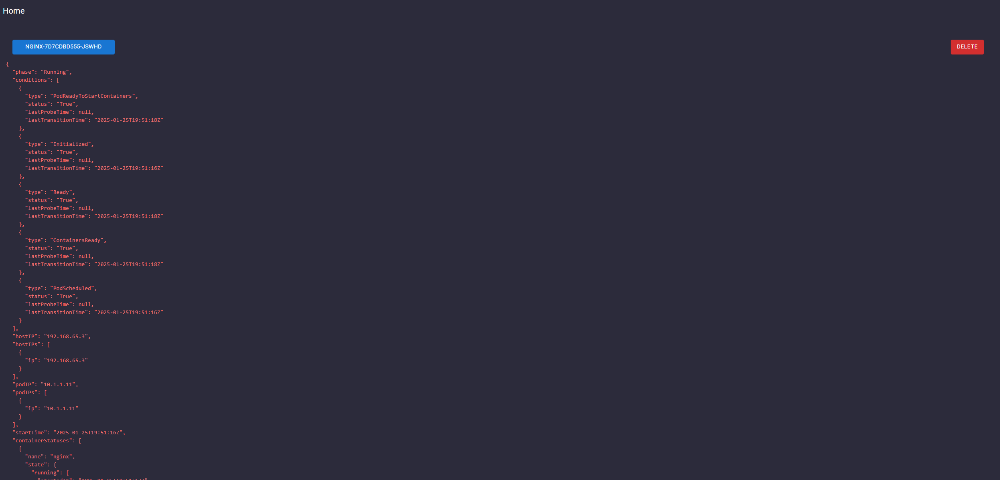

# kubernetes-client-application

Application that uses React as a frontend client and Go with [Fiber](https://gofiber.io/) as the backend. This uses the Kubernetes [client-go](https://github.com/kubernetes/client-go) SDK to interface with Kubernetes.

Usage:

Run both the frontend and backend applications
- Frontend:
  - Build the image then run as a container: `docker run -d -p 8080:8080 kubernetesclientapplication-frontend:latest`
  - Or run outside of a container with `npm run start`
- Backend:
  - Build the image then run as a container: `docker run -d -p 3070:3070 -v /path/to/.kube:/path/to/.kube/ kubernetesclientapplication-backend:latest`
  - Or run outside of a container with `go run .`

